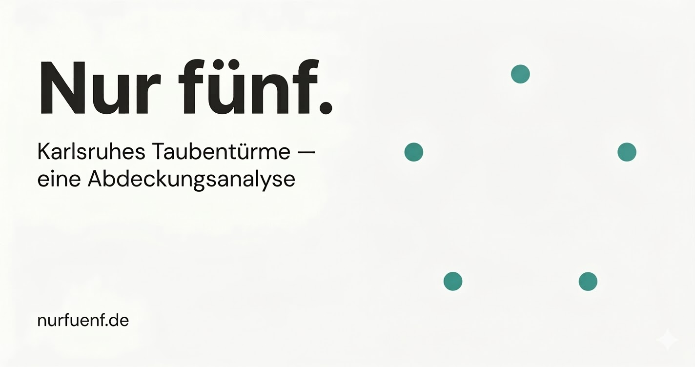

# Karlsruher Taubentürme — Nur Fünf

Karlsruhe verbietet das Füttern von Tauben — bietet aber nur fünf betreute Schläge für das gesamte Stadtgebiet. Wo kein Schlag ist, gibt es weder Futter noch Geburtenkontrolle.

Interaktive Karte mit Bioplan-Daten: [nurfuenf.de](https://nurfuenf.de)
